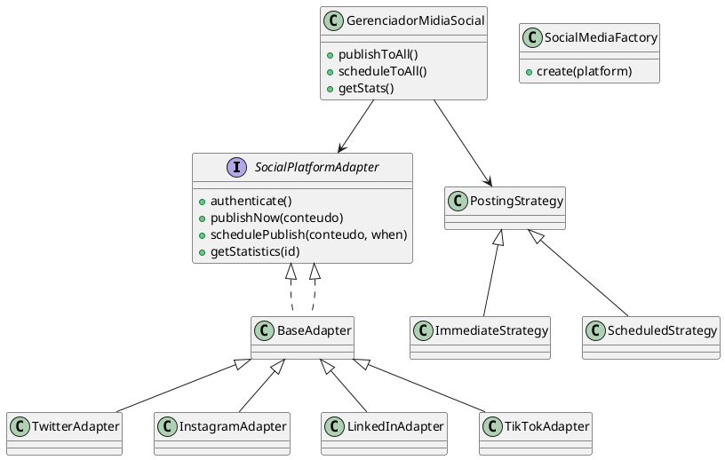

# 🧩 Sistema de Integração de APIs de Mídia Social com Padrão Adapter

## 📘 Visão Geral
Este projeto implementa um **Sistema Unificado de Gerenciamento de Redes Sociais** utilizando o **Padrão de Projeto Adapter**, combinado com os padrões **Factory Method** e **Strategy**. Ele simula a integração com diversas plataformas (Twitter, Instagram, LinkedIn e TikTok), cada uma com suas APIs e estruturas distintas, oferecendo uma interface unificada para publicação e análise.

---

## 🎯 Objetivos
- Demonstrar competência em **design de software orientado a padrões**.
- Criar uma **arquitetura flexível e extensível** para múltiplas APIs.
- Simular operações reais de **autenticação, publicação e estatísticas** em redes sociais.

---

## 🧱 Arquitetura do Sistema
A aplicação é organizada em camadas:

- **models/** → Modelos de domínio (`Conteudo`, `Publicacao`, `Estatisticas`).
- **adapters/** → Adaptadores concretos para cada plataforma (`TwitterAdapter`, `InstagramAdapter`, etc.).
- **core/** → Classes centrais do sistema (`EnvConfig`, `UnifiedResponse`).
- **strategies/** → Estratégias de publicação (`ImmediateStrategy`, `ScheduledStrategy`).
- **factory/** → Fábrica de adaptadores (`SocialMediaFactory`).
- **GerenciadorMidiaSocial** → Classe unificadora que gerencia múltiplos adaptadores.

---

## ⚙️ Padrões de Projeto Utilizados
| Padrão | Aplicação |
|--------|------------|
| **Adapter** | Cria uma interface comum para APIs heterogêneas. |
| **Factory Method** | Permite criar adaptadores dinamicamente conforme a rede social. |
| **Strategy** | Define diferentes políticas de publicação (imediata, agendada). |

---

## 🧩 Principais Classes

### `SocialPlatformAdapter`
Interface principal que define métodos padronizados de autenticação, publicação e estatísticas.

### `BaseAdapter`
Classe abstrata que implementa comportamento comum e simula respostas genéricas das redes sociais.

### `TwitterAdapter`, `InstagramAdapter`, `LinkedInAdapter`, `TikTokAdapter`
Implementações específicas para cada plataforma.

### `SocialMediaFactory`
Responsável por criar dinamicamente os adaptadores corretos com base na configuração.

### `GerenciadorMidiaSocial`
Gerencia todos os adaptadores e permite publicar conteúdo de forma unificada.

### `ImmediateStrategy` / `ScheduledStrategy`
Definem modos diferentes de publicação (imediata e agendada, respectivamente).

---

## 🗂️ Estrutura de Diretórios
```
src/
 └── main/java/com/exercicio/social/
     ├── Main.java
     ├── core/
     │   ├── EnvConfig.java
     │   └── UnifiedResponse.java
     ├── models/
     │   ├── Conteudo.java
     │   ├── Publicacao.java
     │   └── Estatisticas.java
     ├── adapters/
     │   ├── SocialPlatformAdapter.java
     │   ├── BaseAdapter.java
     │   ├── TwitterAdapter.java
     │   ├── InstagramAdapter.java
     │   ├── LinkedInAdapter.java
     │   ├── TikTokAdapter.java
     │   ├── GerenciadorMidiaSocial.java
     │   ├── SocialMediaFactory.java
     │   └── strategies/
     │       ├── PostingStrategy.java
     │       ├── ImmediateStrategy.java
     │       └── ScheduledStrategy.java
```

---

## 🚀 Execução do Projeto

### 🔧 Compilação
```bash
javac -d out $(find src -name "*.java")
```

### ▶️ Execução
```bash
java -cp out com.exercicio.social.Main
```

---

## 🧾 Exemplo de Saída
```
[Twitter] Publicando: Nova campanha lançada!
[Instagram] Publicando: Nova campanha lançada!
[LinkedIn] Publicando: Nova campanha lançada!
[TikTok] Publicando: Nova campanha lançada!
[Agendamento] Post será publicado em 5 segundos...
[Estatísticas] Curtidas: 240 | Compartilhamentos: 88 | Comentários: 12
```

---

## 📊 Diagrama de Classes (PlantUML)


---

## ✍️ Autor
**Eduardo Freitas Grunitzky**  
Exercício prático de Engenharia de Software — Padrões *Adapter*, *Factory* e *Strategy* aplicados em Java.
